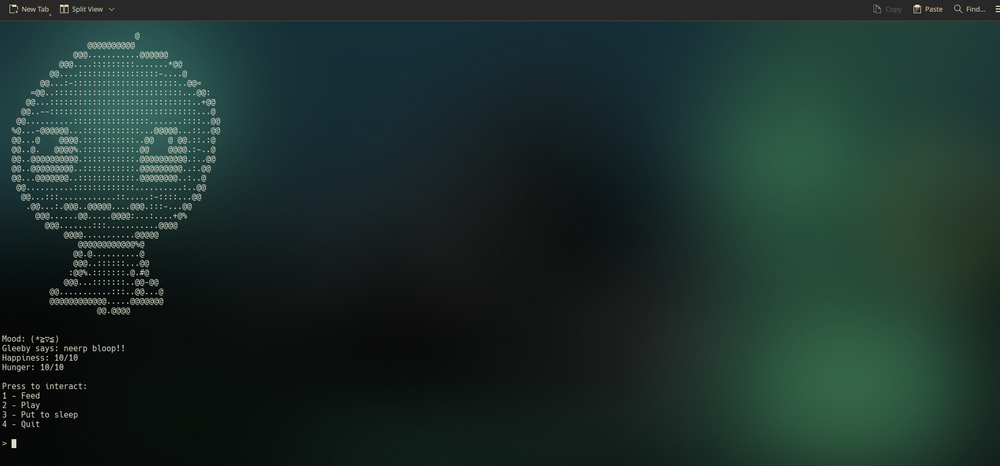

<p align="center">
  
</p>

# **Gleeby - The Game**

**Gleeby** is a quirky, interactive space pet that you can care for right in your terminal! Inspired by Tamagotchi, Gleeby allows you to feed, play, and take care of a small cosmic creature. But beware, it gets hungry and sad if neglected. 🛸

---

### 🌟 **Features**
- 🍽️ **Feed Gleeby** to keep it happy and well-fed
- 🎲 **Play with Gleeby** to boost its mood
- 🛌 **Put Gleeby to sleep** when it’s tired
- 🌌 **Random events** and surprises from the universe
- 🧑‍🚀 **Tracks Gleeby’s hunger** and happiness levels

---

### 🤖 **How it Works**
Gleeby exists as a terminal-based interactive game where you care for it by inputting simple commands. Watch as Gleeby reacts to your choices and becomes either a happy or sad little space pet, depending on how well you take care of it!

---

## 🚀 **Running Gleeby in Your Terminal**

To run Gleeby directly from the terminal using the `gleeby` command, follow these steps:

---


### Step 1: Clone the repository
First, clone this repository to your local machine:
```bash
git clone https://github.com/mossware/gleeby.git
```

### Step 2: Make the script executable
Change to the directory where the script is located:
```bash
cd gleeby
chmod +x gleeby.py
```
### Step 3: Create a symlink for the command
To run Gleeby from anywhere in your terminal, create a symbolic link to the script in a directory that's part of your `PATH`. For example:
```bash
sudo ln -s /path/to/gleeby/gleeby.py /usr/local/bin/gleeby
```
Replace `/path/to/gleeby/gleeby.py` with the actual path where the script is located.

Now, you can run `gleeby` from anywhere in your terminal!

### Step 4: Enjoy playing with Gleeby!
Simply type `gleeby` in your terminal to start the game.
